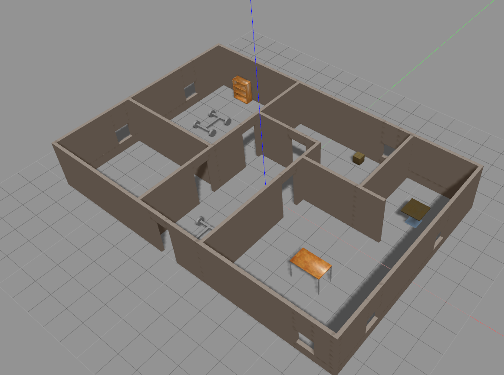

# RoboticsSoftwareEngineerNano-Project1

Build a 3D enviroment to be used in future projects and applications

## To run project:
- enter the source directory "RoboticsSoftwareEngineerNano-Project1"
- create a build directory by running command :$mkdir build
- change directory to build file :$cd build
- Run cmake : $cmake ../
- Run make : $make
- export the plugin path with the location of the build file :

  $export GAZEBO_PLUGIN_PATH=${GAZEBO_PLUGIN_PATH}:/{directory}/build
- change directories to the world folder
- run the world file : $gazebo world
